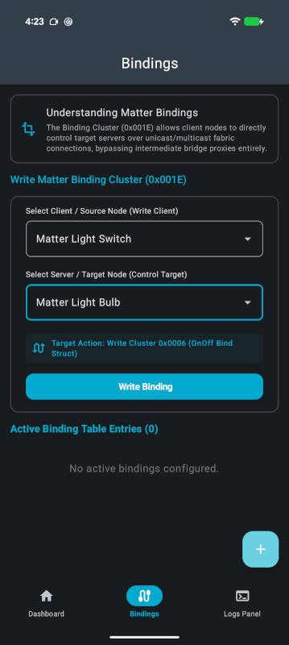

# Configuring bindings

The Bindings screen configures the Binding Cluster (`0x001E`) so a client node, such as a light
switch, controls a target node directly over the Matter fabric instead of routing every command
through the app. Once a binding is written, pressing the physical button on the switch controls the
bound light even if the phone is not present.

  
  
  

The screen is made up of three sections.

| Section | Description |
| --- | --- |
| **Understanding Matter Bindings** | An explanation of the Binding Cluster, with a link to the nRF Connect SDK light switch sample documentation. |
| **Write Matter Binding Cluster (0x001E)** | The form used to create a binding. |
| **Active Binding Table Entries** | The bindings that have already been written, with the count in the heading. |

## Writing a binding

1. Open the **Bindings** tab.
1. Under **Select Client / Source Node (Write Client)**, choose the switch or outlet that will send
   the commands. Each entry is listed by product name and node ID. If no client node has been
   commissioned, the section explains that no compatible source devices were found.
1. Under **Select Server / Target Node (Control Target)**, choose the light to be controlled. Only
   on/off and dimmable lights that are not already bound to the selected source are offered. Until a
   source is chosen, the section asks you to select one first.
1. Confirm the operation summarized by the **Target Action** banner, which states that the On/Off
   cluster (`0x0006`) will be written as a binding entry.
1. Tap **Write Binding**.

While the binding is being written, a full-screen **Binding...** dialog appears with the warning that
the operation may take a few seconds and the app should not be closed. A **PROCESS LOGS** panel below
it streams the Matter traffic as it happens, which is useful when a binding does not take effect. On
success, a confirmation is shown, the form is cleared, and the new entry appears under **Active
Binding Table Entries**.

If the operation fails, a **Binding Failed.** dialog is shown.

!!! caution "The Retry button does not resubmit"

    The **Retry** button in the **Binding Failed.** dialog does not resubmit the operation. Dismiss
    the dialog and write the binding again instead.

## What writing a binding does

Writing a binding involves two operations on two different accessories:

1. An *operate* privilege is granted in the light's Access Control List, so the switch is allowed to
   command it.
1. A binding entry is written into the switch's Binding Table.

Both use endpoint 1 on each accessory. Only unicast bindings are supported — there is no group
binding in the user interface.

## Active binding table entries

Each entry lists its binding ID, the client and server node IDs, and the bound cluster.

The list is read-only. There is no button to delete an individual binding. A binding is removed
automatically when either of the devices it references is decommissioned.
