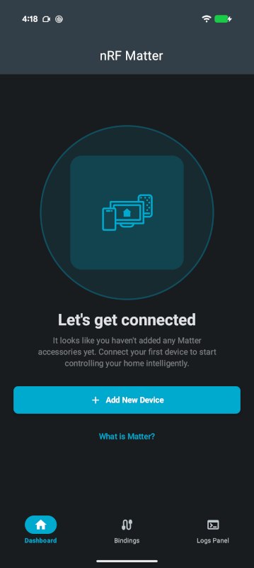
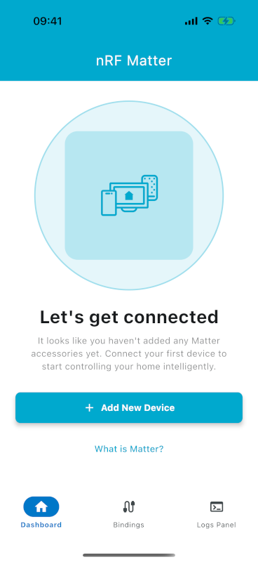
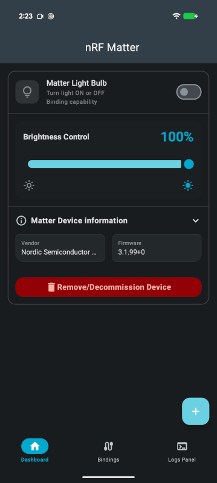

# Overview and user interface

The user interface is shared between Android and iOS through Compose Multiplatform, so the screens,
labels, and controls are identical on both platforms. The only part that differs is the
commissioning step itself, which is handed over to the operating system — Google Play Services on
Android and Apple's `MatterSupport` on iOS.

The screenshots in this documentation show Android in the dark theme and iOS in the light theme; the
app follows the system theme on both platforms.

The app opens on the **Dashboard**. When no accessory has been commissioned yet, the Dashboard shows
a getting-started screen instead of a device list.

  
  

## Common interface

The following elements are present on every screen.

| UI element | Description |
| --- | --- |
| Top app bar | Displays the title of the current screen, centered. It has no back button and no action icons — navigation is done through the bottom navigation bar and the system back gesture. |
| Bottom navigation bar | Switches between the three main screens: **Dashboard**, **Bindings**, and **Logs Panel**. Selecting a tab resets that tab to its top-level screen. |
| Add device button | A floating **+** button in the bottom-right corner that starts commissioning. It is only shown once at least one device has been commissioned; before that, the **Add New Device** button on the Dashboard is used instead. |
| Back navigation | The system back gesture or button closes the current screen. From **Bindings** or **Logs Panel** it returns to the Dashboard; from the Dashboard it leaves the app. |

The top app bar title depends on the current screen, and does not always match the bottom navigation
label:

| Screen | Bottom navigation label | Top app bar title |
| --- | --- | --- |
| Dashboard, no devices commissioned | Dashboard | `nRF Matter` |
| Dashboard, at least one device commissioned | Dashboard | `Dashboard` |
| Bindings | Bindings | `Bindings` |
| Logs | Logs Panel | `Logs` |
| Commissioning | *(not in the bottom navigation)* | `Commissioning` |

## Dashboard

The Dashboard is the home screen and lists every device commissioned onto the app's fabric.

### Getting-started screen

When no device has been commissioned, the Dashboard shows the following elements.

| UI element | Description |
| --- | --- |
| **Let's get connected** | Heading, shown above an animated illustration. |
| Introductory text | Explains that no Matter accessories have been added yet. |
| **Add New Device** | Starts commissioning. This is the only way to add the first device, since the **+** button is hidden while the list is empty. |
| **What is Matter?** | Opens Nordic's Matter documentation in the system browser. |
| `Version: <version>` | The application version, shown at the bottom. This is the only place in the app where the version is displayed — there is no separate About or Settings screen. |

### Device cards

Each commissioned device is shown as a card. The card header always displays the device icon, a
title, and a short subtitle, together with the device's main control. Tapping the header expands the
card to reveal the remaining sections.

  
  

| UI element | Description |
| --- | --- |
| Card header | Device icon, title, subtitle, and the primary control for the device type, for example the on/off switch of a light. Tap to expand or collapse the card. |
| Device-specific controls | Shown when the card is expanded. The available controls depend on the Matter device type — see [Supported device types](#supported-device-types). |
| **Matter Device information** | Expandable row showing **Vendor** and **Firmware** as a preview. Tapping it opens the [Matter Device Information](#matter-device-information) sheet with the full set of Basic Information attributes. |
| **Remove/Decommission Device** | Removes the device from the app's fabric — see [Removing a device](#removing-a-device). |

## Supported device types

The controls offered on a card are chosen from the Matter device type reported by the accessory's
Descriptor cluster.

| Device type | Matter device type ID | Controls available in the app |
| --- | --- | --- |
| On/off light | `0x0100` | On/off switch, **Brightness Control** slider |
| Dimmable light | `0x0101` | On/off switch, **Brightness Control** slider |
| Door lock | `0x000A` | Lock/unlock control |
| Light switch | `0x0103` | None — the switch is a client node and is configured on the **Bindings** screen |
| Dimmer switch | `0x0104` | None — as above |
| Outlet | `0x010A` | None — as above |
| Manufacturer-specific device | `0xFFF10001` | **Generate number** button, **LED** switch, button state indicator |
| Color temperature light | `0x010C` | None — reported as unsupported |
| Extended color light | `0x010D` | None — reported as unsupported |
| Any other device type | — | None — reported as unsupported |

Regardless of the device type, every card provides the **Matter Device information** sheet and the
**Remove/Decommission Device** button.

### Lights

The card is titled with the accessory's product name and the subtitle **Turn light ON or OFF**.

| UI element | Description |
| --- | --- |
| On/off switch | Writes the On/Off cluster (`0x0006`) on the accessory. The app subscribes to the attribute, so the switch also follows changes made from outside the app. |
| **Brightness Control** slider | Writes the Level Control cluster (`0x0008`). The percentage next to the label updates while dragging, and the command is sent when the slider is released. The app subscribes to the level attribute. |
| **Binding capability** | An informational label indicating that the light can be used as a binding target. It is not interactive. |

Both controls are disabled while a command is in flight, to prevent overlapping writes.

### Door lock

| UI element | Description |
| --- | --- |
| Lock state control | A status indicator showing **Locked** or **Unlocked**. Tapping it sends the corresponding Door Lock cluster (`0x0101`) command. |
| Progress indicator | Replaces the status indicator while the command is being carried out, including the intermediate states reported by the lock, such as not-fully-locked and unlatched. |

### Light switches and outlets

Switches and outlets are Matter *client* nodes: they do not expose state for the app to control.
Their card is informational and points to the **Bindings** screen.

| UI element | Description |
| --- | --- |
| Title and subtitle | **Light Switch** and **Bind the switch with other devices**. |
| `Cluster 0x001D (Descriptor Device Map)` | Explains that the node operates as a Matter client whose Binding Table must be configured to link it with target lights. |
| Binding hint | Directs you to manage the switch's targets on the **Bindings** screen. |

### Manufacturer-specific device

This card demonstrates a vendor-defined cluster and a cluster extension, as implemented by the
nRF Connect SDK
[manufacturer-specific sample](https://github.com/nrfconnect/sdk-nrf/tree/v3.3.0/samples/matter/manufacturer_specific).

| UI element | Description |
| --- | --- |
| **Generate number** | Invokes a command added to the Basic Information cluster (`0x28`) by a cluster extension. The returned value is shown below as **Random number**; a placeholder is displayed until the first value arrives. |
| **LED** switch | Writes the manufacturer-specific cluster (`0xFFF1FC01`) to turn the LED on the development kit on or off. |
| Button state | A read-only indicator that follows a subscription to the same manufacturer-specific cluster. It reads **Press button 01** until the physical button on the kit is pressed, and **Button pressed** while it is held. |

### Unsupported device types

For device types the app does not implement, the card shows the product name, the subtitle
**Device not supported in this version of the app.**, and an explanation that the local application
profile has not been implemented yet. The **Matter Device information** sheet and the
**Remove/Decommission Device** button remain available, so the accessory can still be inspected and
removed.

## Matter Device Information

This sheet reads the accessory's Basic Information cluster (`0x0028`). The values are fetched from
the accessory when the secure session is established. Fields that the accessory does not report are
omitted.

| Field | Attribute |
| --- | --- |
| Product Name | `0x0003` |
| Vendor ID | `0x0002` |
| Product ID | `0x0004` |
| Vendor Name | `0x0001` |
| Software Version | `0x0009` |
| Serial Number | `0x000F` |
| Unique ID | `0x0012` |
| Specification Version | `0x0013` |

**Close** dismisses the sheet.

## Removing a device

**Remove/Decommission Device** removes the accessory from the app's fabric and deletes any bindings
that reference it. The device list is dimmed while the operation runs.

| State | What is shown |
| --- | --- |
| In progress | A blocking overlay reading **Removing device...** and **It might take a few seconds, please wait!** |
| Failed | An **Error Removing Device** dialog offering to force-remove the device. **Delete** drops the device from the app's local storage even though the accessory could not be reached; **Cancel** keeps it in the list. |
| Succeeded | A confirmation message, after which the device disappears from the list. |

!!! note "Note"

    Force-removing a device only clears the app's own records. The accessory keeps the fabric
    credentials it was given, so it may need to be factory reset before it can be commissioned again.
